# Documentation Technique - Module AuditDigital

## 🏗️ Architecture Technique

### Vue d'ensemble

Le module AuditDigital suit l'architecture standard de Dolibarr avec des extensions spécifiques pour la gestion des audits de maturité numérique.

```
┌─────────────────────────────────────────────────────────────┐
│                    ARCHITECTURE GLOBALE                     │
├─────────────────────────────────────────────────────────────┤
│  Frontend (UI)                                             │
│  ├── Wizard JavaScript (wizard.js)                        │
│  ├── CSS personnalisé (auditdigital.css)                  │
│  └── Templates PHP (wizard/, admin/)                      │
├─────────────────────────────────────────────────────────────┤
│  Backend (Logic)                                          │
│  ├── Classes métier (class/)                              │
│  ├── Modules Dolibarr (core/modules/)                     │
│  └── Bibliothèques (lib/)                                 │
├─────────────────────────────────────────────────────────────┤
│  Data Layer                                               │
│  ├── Base de données MySQL                                │
│  ├── Fichiers JSON (solutions)                            │
│  └── Documents générés (PDF)                              │
└─────────────────────────────────────────────────────────────┘
```

### Structure des fichiers

```
auditdigital/
├── core/
│   ├── modules/
│   │   ├── modAuditDigital.class.php          # Module principal
│   │   └── auditdigital/
│   │       ├── doc/
│   │       │   └── pdf_audit_tpe.modules.php  # Générateur PDF
│   │       ├── mod_audit_standard.php         # Numérotation
│   │       └── modules_audit.php              # Classes de base
│   └── triggers/
│       └── interface_99_modAuditDigital_AuditTriggers.class.php
├── class/
│   ├── audit.class.php                        # Classe principale Audit
│   ├── questionnaire.class.php                # Gestion questionnaire
│   ├── solutionlibrary.class.php             # Bibliothèque solutions
│   └── api_audit.class.php                   # API REST
├── wizard/
│   ├── index.php                              # Interface wizard
│   └── steps/                                 # Étapes individuelles
├── admin/
│   ├── setup.php                              # Configuration
│   └── solutions.php                          # Gestion solutions
├── sql/
│   ├── llx_auditdigital_audit.sql            # Table audits
│   ├── llx_auditdigital_audit.key.sql        # Index et contraintes
│   ├── llx_auditdigital_solutions.sql        # Table solutions
│   └── data.sql                               # Données initiales
├── css/auditdigital.css                       # Styles
├── js/wizard.js                               # JavaScript wizard
├── langs/fr_FR/auditdigital.lang             # Traductions
├── lib/auditdigital.lib.php                  # Fonctions utilitaires
├── data/solutions.json                        # Bibliothèque solutions
└── img/                                       # Images et icônes
```

---

## 🗄️ Base de Données

### Schéma des tables

#### Table `llx_auditdigital_audit`

```sql
CREATE TABLE llx_auditdigital_audit (
    rowid integer AUTO_INCREMENT PRIMARY KEY,
    ref varchar(128) NOT NULL UNIQUE,
    label varchar(255) NOT NULL,
    audit_type varchar(50) NOT NULL,
    structure_type varchar(50) NOT NULL,
    fk_soc integer NOT NULL,
    fk_projet integer,
    date_creation datetime NOT NULL,
    date_audit datetime,
    date_valid datetime,
    fk_user_creat integer NOT NULL,
    fk_user_valid integer,
    status integer DEFAULT 0,
    score_global integer,
    score_maturite integer,
    score_cybersecurite integer,
    score_cloud integer,
    score_automatisation integer,
    json_config text,
    json_responses text,
    json_recommendations text,
    note_private text,
    note_public text,
    model_pdf varchar(255) DEFAULT 'standard',
    entity integer DEFAULT 1,
    import_key varchar(14),
    tms timestamp DEFAULT CURRENT_TIMESTAMP ON UPDATE CURRENT_TIMESTAMP
);
```

**Index et contraintes :**
```sql
-- Index de performance
CREATE INDEX idx_audit_soc ON llx_auditdigital_audit(fk_soc);
CREATE INDEX idx_audit_date ON llx_auditdigital_audit(date_audit);
CREATE INDEX idx_audit_status ON llx_auditdigital_audit(status);
CREATE INDEX idx_audit_type ON llx_auditdigital_audit(structure_type);

-- Contraintes
ALTER TABLE llx_auditdigital_audit 
ADD CONSTRAINT fk_audit_soc 
FOREIGN KEY (fk_soc) REFERENCES llx_societe(rowid);

ALTER TABLE llx_auditdigital_audit 
ADD CONSTRAINT fk_audit_user_creat 
FOREIGN KEY (fk_user_creat) REFERENCES llx_user(rowid);
```

#### Table `llx_auditdigital_solutions`

```sql
CREATE TABLE llx_auditdigital_solutions (
    rowid integer AUTO_INCREMENT PRIMARY KEY,
    ref varchar(128) NOT NULL UNIQUE,
    label varchar(255) NOT NULL,
    category varchar(100) NOT NULL,
    sub_category varchar(100),
    solution_type varchar(100) NOT NULL,
    target_audience varchar(100),
    price_range varchar(50),
    implementation_time integer,
    priority integer DEFAULT 0,
    roi_percentage integer,
    roi_months integer,
    json_features text,
    json_benefits text,
    json_requirements text,
    description text,
    active integer DEFAULT 1,
    date_creation datetime NOT NULL,
    entity integer DEFAULT 1,
    tms timestamp DEFAULT CURRENT_TIMESTAMP ON UPDATE CURRENT_TIMESTAMP
);
```

**Index de performance :**
```sql
CREATE INDEX idx_solutions_category ON llx_auditdigital_solutions(category);
CREATE INDEX idx_solutions_target ON llx_auditdigital_solutions(target_audience);
CREATE INDEX idx_solutions_active ON llx_auditdigital_solutions(active);
CREATE INDEX idx_solutions_priority ON llx_auditdigital_solutions(priority);
```

### Modèle de données

#### Relations entre entités

```mermaid
erDiagram
    SOCIETE ||--o{ AUDIT : "fk_soc"
    USER ||--o{ AUDIT : "fk_user_creat"
    PROJECT ||--o{ AUDIT : "fk_projet"
    AUDIT ||--o{ DOCUMENT : "génère"
    SOLUTIONS ||--o{ RECOMMENDATIONS : "recommande"
    
    AUDIT {
        int rowid PK
        string ref UK
        string label
        string audit_type
        string structure_type
        int fk_soc FK
        int fk_projet FK
        datetime date_creation
        datetime date_audit
        int fk_user_creat FK
        int status
        int score_global
        text json_responses
        text json_recommendations
    }
    
    SOLUTIONS {
        int rowid PK
        string ref UK
        string label
        string category
        string target_audience
        string price_range
        int priority
        int roi_percentage
        text json_features
        text json_benefits
    }
```



---

## 🔧 Classes PHP

### Classe `Audit`

#### Propriétés principales

```php
class Audit extends CommonObject
{
    // Constantes de statut
    const STATUS_DRAFT = 0;
    const STATUS_VALIDATED = 1;
    const STATUS_SENT = 2;
    
    // Propriétés de base
    public $element = 'audit';
    public $table_element = 'auditdigital_audit';
    public $picto = 'audit@auditdigital';
    
    // Champs de la table
    public $ref;
    public $label;
    public $audit_type;
    public $structure_type;
    public $fk_soc;
    public $score_global;
    public $json_responses;
    public $json_recommendations;
    
    // Relations
    public $thirdparty;
    public $project;
}
```

#### Méthodes principales

```php
/**
 * Créer un audit
 */
public function create(User $user, $notrigger = false)
{
    global $conf;
    
    $this->db->begin();
    
    // Générer la référence
    if ($this->ref == '(PROV)') {
        $this->ref = $this->getNextNumRef();
    }
    
    // Validation des données
    if (empty($this->label)) {
        $this->error = 'Label required';
        return -1;
    }
    
    // Insertion en base
    $result = $this->createCommon($user, $notrigger);
    
    if ($result > 0) {
        $this->db->commit();
        return $this->id;
    } else {
        $this->db->rollback();
        return -1;
    }
}

/**
 * Calculer les scores
 */
public function calculateScores($responses)
{
    $questionnaire = new Questionnaire($this->db);
    
    $scores = array(
        'maturite' => 0,
        'cybersecurite' => 0,
        'cloud' => 0,
        'automatisation' => 0
    );
    
    // Calcul par domaine
    foreach ($scores as $domain => $score) {
        $stepKey = 'step' . $this->getDomainStepNumber($domain);
        if (isset($responses[$stepKey])) {
            $scores[$domain] = $questionnaire->calculateStepScore(
                $stepKey, 
                $responses[$stepKey]
            );
        }
    }
    
    // Score global (moyenne pondérée)
    $weights = array(
        'maturite' => 0.25,
        'cybersecurite' => 0.30,
        'cloud' => 0.25,
        'automatisation' => 0.20
    );
    
    $globalScore = 0;
    foreach ($scores as $domain => $score) {
        $globalScore += $score * $weights[$domain];
    }
    
    $scores['global'] = round($globalScore);
    
    return $scores;
}

/**
 * Générer les recommandations
 */
public function generateRecommendations($scores, $structureType)
{
    $solutionLibrary = new SolutionLibrary($this->db);
    $recommendations = array();
    
    // Seuils de recommandation
    $thresholds = array(
        'critical' => 40,
        'improvement' => 70
    );
    
    foreach ($scores as $domain => $score) {
        if ($domain == 'global') continue;
        
        $priority = 'low';
        if ($score < $thresholds['critical']) {
            $priority = 'high';
        } elseif ($score < $thresholds['improvement']) {
            $priority = 'medium';
        }
        
        // Récupérer les solutions pour ce domaine
        $solutions = $solutionLibrary->getSolutionsByCategory(
            $domain, 
            $structureType, 
            3
        );
        
        $recommendations[$domain] = array(
            'score' => $score,
            'priority' => $priority,
            'solutions' => $solutions
        );
    }
    
    return $recommendations;
}

/**
 * Générer le PDF
 */
public function generateDocument($modele, $outputlangs, $hidedetails = 0, $hidedesc = 0, $hideref = 0)
{
    global $conf, $user;
    
    // Charger le modèle
    $modelpath = "core/modules/auditdigital/doc/";
    $modele = dol_sanitizeFileName($modele);
    
    if (!dol_is_file(DOL_DOCUMENT_ROOT."/custom/auditdigital/".$modelpath."pdf_".$modele.".modules.php")) {
        $this->error = "Template not found";
        return -1;
    }
    
    require_once DOL_DOCUMENT_ROOT."/custom/auditdigital/".$modelpath."pdf_".$modele.".modules.php";
    
    $classname = "pdf_".$modele;
    $obj = new $classname($this->db);
    
    // Générer le PDF
    $result = $obj->write_file($this, $outputlangs, '', $hidedetails, $hidedesc, $hideref);
    
    if ($result > 0) {
        return 1;
    } else {
        $this->error = $obj->error;
        return -1;
    }
}
```

### Classe `Questionnaire`

#### Structure du questionnaire

```php
class Questionnaire
{
    private $questionnaire = array(
        'step1_general' => array(
            'title' => 'Informations générales',
            'questions' => array(
                'structure_type' => array(
                    'type' => 'radio',
                    'label' => 'Type de structure',
                    'required' => true,
                    'options' => array(...)
                )
            )
        ),
        'step2_maturite' => array(
            'title' => 'Maturité numérique',
            'questions' => array(
                'website_presence' => array(
                    'type' => 'radio',
                    'score_mapping' => array(0 => 1, 1 => 3, 2 => 5),
                    'options' => array(...)
                )
            )
        )
    );
    
    /**
     * Calculer le score d'une étape
     */
    public function calculateStepScore($step, $responses)
    {
        $stepData = $this->getStep($step);
        $totalScore = 0;
        $maxScore = 0;
        
        foreach ($stepData['questions'] as $questionId => $question) {
            if (isset($question['score_mapping']) && isset($responses[$questionId])) {
                $response = $responses[$questionId];
                if (isset($question['score_mapping'][$response])) {
                    $totalScore += $question['score_mapping'][$response];
                }
                $maxScore += max($question['score_mapping']);
            }
        }
        
        return $maxScore > 0 ? round(($totalScore / $maxScore) * 100) : 0;
    }
}
```

### Classe `SolutionLibrary`

#### Gestion des solutions

```php
class SolutionLibrary extends CommonObject
{
    /**
     * Charger solutions depuis JSON
     */
    public function loadFromJson($jsonFile)
    {
        if (!file_exists($jsonFile)) {
            $this->error = 'JSON file not found';
            return -1;
        }
        
        $jsonContent = file_get_contents($jsonFile);
        $data = json_decode($jsonContent, true);
        
        if (json_last_error() !== JSON_ERROR_NONE) {
            $this->error = 'Invalid JSON format';
            return -2;
        }
        
        $loaded = 0;
        $this->db->begin();
        
        foreach ($data['solutions'] as $categoryKey => $categoryData) {
            foreach ($categoryData as $solutionKey => $solutionData) {
                $solution = new self($this->db);
                
                // Mapper les données JSON
                $solution->ref = $solutionData['ref'];
                $solution->label = $solutionData['label'];
                $solution->category = $solutionData['category'];
                $solution->target_audience = implode(',', $solutionData['target_audience']);
                $solution->setFeatures($solutionData['features']);
                $solution->setBenefits($solutionData['benefits']);
                
                // Vérifier si existe déjà
                $existing = $this->fetchAll('', '', 0, 0, array('ref' => $solution->ref));
                if (empty($existing)) {
                    $result = $solution->create($user);
                    if ($result > 0) {
                        $loaded++;
                    }
                }
            }
        }
        
        $this->db->commit();
        return $loaded;
    }
    
    /**
     * Obtenir solutions par critères
     */
    public function getSolutionsByCategory($category, $targetAudience = '', $limit = 0)
    {
        $filter = array('category' => $category, 'active' => 1);
        
        if (!empty($targetAudience)) {
            $filter['customsql'] = "(target_audience LIKE '%".$this->db->escape($targetAudience)."%' OR target_audience LIKE '%all%')";
        }
        
        return $this->fetchAll('priority', 'DESC', $limit, 0, $filter);
    }
}
```

---

## 🎨 Frontend

### JavaScript - Wizard

#### Architecture du wizard

```javascript
class AuditWizard {
    constructor() {
        this.currentStep = 1;
        this.totalSteps = 6;
        this.responses = {};
        this.scores = {};
        
        this.init();
    }
    
    init() {
        this.updateProgress();
        this.bindEvents();
        this.loadSavedData();
    }
    
    /**
     * Navigation entre étapes
     */
    nextStep() {
        if (this.validateCurrentStep()) {
            if (this.currentStep < this.totalSteps) {
                this.currentStep++;
                this.showStep(this.currentStep);
                this.updateProgress();
                this.saveData();
            }
        }
    }
    
    /**
     * Validation d'une étape
     */
    validateCurrentStep() {
        const currentStepElement = document.querySelector(`#step${this.currentStep}`);
        const requiredFields = currentStepElement.querySelectorAll('[required]');
        let isValid = true;
        
        requiredFields.forEach(field => {
            if (!this.isFieldValid(field)) {
                this.showFieldError(field);
                isValid = false;
            }
        });
        
        return isValid;
    }
    
    /**
     * Calcul des scores en temps réel
     */
    calculateStepScore(stepNumber) {
        const stepResponses = this.responses[stepNumber];
        if (!stepResponses) return;
        
        let score = 0;
        let maxScore = 0;
        
        Object.keys(stepResponses).forEach(questionName => {
            const questionElement = document.querySelector(`input[name="${questionName}"]`);
            if (questionElement && questionElement.dataset.scoreMapping) {
                const scoreMapping = JSON.parse(questionElement.dataset.scoreMapping);
                const response = stepResponses[questionName];
                
                if (scoreMapping[response] !== undefined) {
                    score += scoreMapping[response];
                }
                maxScore += Math.max(...Object.values(scoreMapping));
            }
        });
        
        const stepScore = maxScore > 0 ? Math.round((score / maxScore) * 100) : 0;
        this.scores[this.getCategoryFromStep(stepNumber)] = stepScore;
        this.updateScoreDisplay();
    }
    
    /**
     * Sauvegarde automatique
     */
    saveData() {
        const data = {
            currentStep: this.currentStep,
            responses: this.responses,
            scores: this.scores,
            timestamp: new Date().toISOString()
        };
        
        localStorage.setItem('audit_wizard_data', JSON.stringify(data));
    }
    
    /**
     * Finalisation de l'audit
     */
    submitAudit() {
        const auditData = {
            responses: this.responses,
            scores: this.scores,
            structure_type: this.responses['1'] ? this.responses['1']['structure_type'] : '',
            timestamp: new Date().toISOString()
        };
        
        fetch(window.location.href, {
            method: 'POST',
            headers: {
                'Content-Type': 'application/json',
                'X-Requested-With': 'XMLHttpRequest'
            },
            body: JSON.stringify(auditData)
        })
        .then(response => response.json())
        .then(data => {
            if (data.success) {
                this.showSuccess('Audit finalisé avec succès !');
                localStorage.removeItem('audit_wizard_data');
                
                if (data.redirect) {
                    setTimeout(() => {
                        window.location.href = data.redirect;
                    }, 2000);
                }
            } else {
                this.showError(data.error || 'Erreur lors de la finalisation');
            }
        })
        .catch(error => {
            console.error('Error:', error);
            this.showError('Erreur de communication avec le serveur');
        });
    }
}
```

### CSS - Styles

#### Variables CSS

```css
:root {
    --audit-primary: #0066CC;
    --audit-secondary: #004499;
    --audit-success: #28A745;
    --audit-warning: #FD7E14;
    --audit-text: #495057;
    --audit-light: #F8F9FA;
    --audit-border: #DEE2E6;
}
```

#### Composants principaux

```css
/* Wizard container */
.audit-wizard {
    max-width: 1200px;
    margin: 0 auto;
    padding: 20px;
}

/* Progress bar */
.audit-progress-bar {
    width: 100%;
    height: 8px;
    background: var(--audit-light);
    border-radius: 4px;
    overflow: hidden;
}

.audit-progress-fill {
    height: 100%;
    background: linear-gradient(90deg, var(--audit-primary), var(--audit-secondary));
    transition: width 0.3s ease;
}

/* Form elements */
.audit-radio-item {
    display: flex;
    align-items: center;
    padding: 12px 15px;
    border: 2px solid var(--audit-border);
    border-radius: 6px;
    cursor: pointer;
    transition: all 0.3s ease;
}

.audit-radio-item:hover {
    border-color: var(--audit-primary);
    background: rgba(0, 102, 204, 0.05);
}

.audit-radio-item.selected {
    border-color: var(--audit-primary);
    background: rgba(0, 102, 204, 0.1);
}

/* Score display */
.audit-score-card {
    background: white;
    border: 2px solid var(--audit-border);
    border-radius: 10px;
    padding: 20px;
    text-align: center;
    transition: transform 0.3s ease;
}

.audit-score-excellent { color: var(--audit-success); }
.audit-score-good { color: #17a2b8; }
.audit-score-average { color: var(--audit-warning); }
.audit-score-poor { color: #dc3545; }
.audit-score-critical { color: #6f42c1; }
```

---

## 🔌 API REST

### Endpoints disponibles

#### Authentification

```http
POST /api/index.php/login
Content-Type: application/json

{
  "login": "username",
  "password": "password"
}

Response:
{
  "success": {
    "token": "eyJ0eXAiOiJKV1QiLCJhbGciOiJIUzI1NiJ9..."
  }
}
```

#### Gestion des audits

```http
# Liste des audits
GET /api/index.php/auditdigital/audits
Authorization: Bearer {token}

Response:
[
  {
    "id": 1,
    "ref": "AUD20241205-0001",
    "label": "Audit Digital - Entreprise ABC",
    "structure_type": "tpe_pme",
    "score_global": 67,
    "status": 1,
    "date_creation": "2024-12-05 10:30:00"
  }
]

# Détail d'un audit
GET /api/index.php/auditdigital/audits/{id}
Authorization: Bearer {token}

Response:
{
  "id": 1,
  "ref": "AUD20241205-0001",
  "label": "Audit Digital - Entreprise ABC",
  "structure_type": "tpe_pme",
  "scores": {
    "global": 67,
    "maturite": 72,
    "cybersecurite": 45,
    "cloud": 68,
    "automatisation": 83
  },
  "responses": {...},
  "recommendations": {...},
  "thirdparty": {
    "id": 123,
    "name": "Entreprise ABC"
  }
}

# Créer un audit
POST /api/index.php/auditdigital/audits
Authorization: Bearer {token}
Content-Type: application/json

{
  "label": "Nouvel audit",
  "fk_soc": 123,
  "structure_type": "tpe_pme",
  "audit_type": "digital_maturity"
}

Response:
{
  "id": 2,
  "ref": "AUD20241205-0002"
}

# Mettre à jour un audit
PUT /api/index.php/auditdigital/audits/{id}
Authorization: Bearer {token}
Content-Type: application/json

{
  "responses": {...},
  "scores": {...}
}

# Générer PDF
GET /api/index.php/auditdigital/audits/{id}/pdf
Authorization: Bearer {token}

Response: Binary PDF content
```

#### Gestion des solutions

```http
# Liste des solutions
GET /api/index.php/auditdigital/solutions
Authorization: Bearer {token}

Query parameters:
- category: string (maturite_numerique, cybersecurite, cloud, automatisation)
- target_audience: string (tpe, pme, collectivite, all)
- active: boolean (true/false)
- limit: integer

Response:
[
  {
    "id": 1,
    "ref": "SOL-WEB-001",
    "label": "Création site web vitrine moderne",
    "category": "maturite_numerique",
    "target_audience": "tpe,pme,collectivite",
    "price_range": "5k",
    "roi_percentage": 25,
    "features": [...],
    "benefits": [...]
  }
]
```

### Classe API

```php
class ApiAudit
{
    private $db;
    private $user;
    
    public function __construct($db)
    {
        $this->db = $db;
    }
    
    /**
     * GET /audits
     */
    public function getAudits($filters = array())
    {
        // Vérifier permissions
        if (!$this->user->rights->auditdigital->audit->read) {
            return $this->error(403, 'Permission denied');
        }
        
        $audit = new Audit($this->db);
        $audits = $audit->fetchAll('', '', 0, 0, $filters);
        
        $result = array();
        foreach ($audits as $auditObj) {
            $result[] = array(
                'id' => $auditObj->id,
                'ref' => $auditObj->ref,
                'label' => $auditObj->label,
                'structure_type' => $auditObj->structure_type,
                'score_global' => $auditObj->score_global,
                'status' => $auditObj->status,
                'date_creation' => $auditObj->date_creation
            );
        }
        
        return $this->success($result);
    }
    
    /**
     * POST /audits
     */
    public function createAudit($data)
    {
        // Vérifier permissions
        if (!$this->user->rights->auditdigital->audit->write) {
            return $this->error(403, 'Permission denied');
        }
        
        // Validation
        if (empty($data['label']) || empty($data['fk_soc'])) {
            return $this->error(400, 'Missing required fields');
        }
        
        $audit = new Audit($this->db);
        $audit->ref = '(PROV)';
        $audit->label = $data['label'];
        $audit->fk_soc = $data['fk_soc'];
        $audit->structure_type = $data['structure_type'] ?? 'tpe_pme';
        $audit->audit_type = $data['audit_type'] ?? 'digital_maturity';
        $audit->date_creation = dol_now();
        $audit->fk_user_creat = $this->user->id;
        
        $result = $audit->create($this->user);
        
        if ($result > 0) {
            return $this->success(array(
                'id' => $audit->id,
                'ref' => $audit->ref
            ));
        } else {
            return $this->error(500, $audit->error);
        }
    }
    
    /**
     * Réponse de succès
     */
    private function success($data)
    {
        http_response_code(200);
        header('Content-Type: application/json');
        echo json_encode($data);
        exit;
    }
    
    /**
     * Réponse d'erreur
     */
    private function error($code, $message)
    {
        http_response_code($code);
        header('Content-Type: application/json');
        echo json_encode(array('error' => $message));
        exit;
    }
}
```

---

## 📄 Génération PDF

### Architecture du générateur

```php
class pdf_audit_tpe extends ModelePDFAudit
{
    /**
     * Générer le fichier PDF
     */
    public function write_file($object, $outputlangs, $srctemplatepath = '', $hidedetails = 0, $hidedesc = 0, $hideref = 0)
    {
        global $conf, $user;
        
        // Initialisation PDF
        $pdf = pdf_getInstance($this->format);
        $pdf->SetAutoPageBreak(1, 0);
        
        // Configuration
        $pdf->SetTitle($outputlangs->convToOutputCharset($object->ref));
        $pdf->SetSubject($outputlangs->transnoentities("Audit"));
        $pdf->SetCreator("Dolibarr ".DOL_VERSION);
        $pdf->SetAuthor($outputlangs->convToOutputCharset($user->getFullName($outputlangs)));
        
        // Génération du contenu
        $pdf->AddPage();
        $this->_pagehead($pdf, $object, 1, $outputlangs);
        $this->_displayScores($pdf, $object, $outputlangs);
        $this->_displayRecommendations($pdf, $object, $outputlangs);
        $this->_pagefoot($pdf, $object, $outputlangs, 1);
        
        // Sauvegarde
        $file = $conf->auditdigital->dir_output.'/'.$object->ref.'/'.$object->ref.'.pdf';
        $pdf->Output($file, 'F');
        
        return 1;
    }
    
    /**
     * En-tête de page
     */
    protected function _pagehead(&$pdf, $object, $showaddress, $outputlangs)
    {
        // Logo
        if (!empty($this->emetteur->logo)) {
            $logo = $conf->mycompany->dir_output.'/logos/'.$this->emetteur->logo;
            if (is_readable($logo)) {
                $height = pdf_getHeightForLogo($logo);
                $pdf->Image($logo, $this->marge_gauche, $this->marge_haute, 0, $height);
            }
        }
        
        // Titre
        $pdf->SetFont('', 'B', 16);
        $pdf->SetXY($this->page_largeur - 100, $this->marge_haute);
        $pdf->Cell(90, 10, $outputlangs->transnoentities("AuditDigital"), 0, 1, 'R');
        
        // Référence
        $pdf->SetFont('', '', 12);
        $pdf->SetXY($this->page_largeur - 100, $this->marge_haute + 15);
        $pdf->Cell(90, 8, $outputlangs->transnoentities("Ref")." : ".$object->ref, 0, 1, 'R');
        
        return $this->marge_haute + 40;
    }
    
    /**
     * Affichage des scores
     */
    protected function _displayScores(&$pdf, $object, $outputlangs)
    {
        $pdf->SetFont('', 'B', 14);
        $pdf->SetXY($this->marge_gauche, $pdf->GetY() + 10);
        $pdf->Cell(0, 8, $outputlangs->transnoentities("AuditScores"), 0, 1, 'L');
        
        // Scores par domaine
        $scores = array(
            'Global' => $object->score_global,
            'Maturité' => $object->score_maturite,
            'Cybersécurité' => $object->score_cybersecurite,
            'Cloud' => $object->score_cloud,
            'Automatisation' => $object->score_automatisation
        );
        
        $y = $pdf->GetY() + 5;
        foreach ($scores as $label => $score) {
            $pdf->SetXY($this->marge_gauche, $y);
            $pdf->SetFont('', '', 10);
            $pdf->Cell(60, 6, $label.' :', 0, 0, 'L');
            
            // Couleur selon le score
            $color = $this->getScoreColor($score);
            $pdf->SetTextColor($color[0], $color[1], $color[2]);
            $pdf->SetFont('', 'B', 10);
            $pdf->Cell(30, 6, ($score ?: 0).'%', 0, 1, 'L');
            $pdf->SetTextColor(0, 0, 0);
            
            $y += 8;
        }
    }
    
    /**
     * Couleur selon le score
     */
    private function getScoreColor($score)
    {
        if ($score >= 80) return array(40, 167, 69);      // Vert
        if ($score >= 60) return array(23, 162, 184);     // Bleu
        if ($score >= 40) return array(253, 126, 20);     // Orange
        if ($score >= 20) return array(220, 53, 69);      // Rouge
        return array(111, 66, 193);                       // Violet
    }
}
```

### Templates personnalisables

#### Structure du template

```php
// Template de base
abstract class ModelePDFAudit extends CommonDocGenerator
{
    // Propriétés communes
    public $page_largeur;
    public $page_hauteur;
    public $marge_gauche;
    public $marge_droite;
    public $marge_haute;
    public $marge_basse;
    
    // Méthodes à implémenter
    abstract public function write_file($object, $outputlangs, $srctemplatepath = '', $hidedetails = 0, $hidedesc = 0, $hideref = 0);
    
    // Méthodes utilitaires
    protected function _pagehead(&$pdf, $object, $showaddress, $outputlangs) { }
    protected function _pagefoot(&$pdf, $object, $outputlangs, $hidefreetext = 0) { }
    protected function _displayScores(&$pdf, $object, $outputlangs) { }
    protected function _displayRecommendations(&$pdf, $object, $outputlangs) { }
}
```

---

## 🔧 Configuration et Hooks

### Hooks disponibles

#### Hook de création d'audit

```php
// Dans un module tiers
class InterfaceMyModule
{
    public function doActions($parameters, &$object, &$action, $hookmanager)
    {
        $contexts = explode(':', $parameters['context']);
        
        if (in_array('auditcreation', $contexts)) {
            // Code exécuté lors de la création d'un audit
            dol_syslog("Audit créé : ".$object->ref);
            
            // Exemple : envoyer une notification
            $this->sendNotification($object);
        }
        
        return 0;
    }
    
    private function sendNotification($audit)
    {
        // Logique de notification
        $message = "Nouvel audit créé : ".$audit->ref;
        // Envoyer email, webhook, etc.
    }
}
```

#### Hook de calcul de score

```php
public function doActions($parameters, &$object, &$action, $hookmanager)
{
    if ($parameters['context'] == 'auditscore') {
        // Modifier le calcul de score
        $customScore = $this->calculateCustomScore($object);
        $object->score_custom = $customScore;
    }
    
    return 0;
}

private function calculateCustomScore($audit)
{
    // Logique de calcul personnalisée
    $responses = json_decode($audit->json_responses, true);
    
    // Exemple : bonus secteur
    $sectorBonus = 0;
    if (isset($responses['step1_general']['sector'])) {
        $sector = $responses['step1_general']['sector'];
        $sectorBonus = $this->getSectorBonus($sector);
    }
    
    return $audit->score_global + $sectorBonus;
}
```

### Triggers disponibles

#### Trigger de validation

```php
class InterfaceAuditTriggers
{
    public function runTrigger($action, $object, User $user, Translate $langs, Conf $conf)
    {
        switch ($action) {
            case 'AUDIT_VALIDATE':
                return $this->onAuditValidate($object, $user);
                
            case 'AUDIT_CREATE':
                return $this->onAuditCreate($object, $user);
                
            case 'AUDIT_MODIFY':
                return $this->onAuditModify($object, $user);
        }
        
        return 0;
    }
    
    private function onAuditValidate($audit, $user)
    {
        // Actions lors de la validation
        
        // 1. Générer automatiquement le PDF
        $audit->generateDocument('audit_tpe', $langs);
        
        // 2. Créer une tâche de suivi
        $this->createFollowUpTask($audit, $user);
        
        // 3. Envoyer notification au commercial
        $this->notifyCommercial($audit, $user);
        
        return 1;
    }
    
    private function createFollowUpTask($audit, $user)
    {
        if (isModEnabled('project')) {
            require_once DOL_DOCUMENT_ROOT.'/projet/class/task.class.php';
            
            $task = new Task($this->db);
            $task->fk_project = $audit->fk_projet;
            $task->label = "Suivi audit ".$audit->ref;
            $task->description = "Relancer le client suite à l'audit digital";
            $task->dateo = dol_now();
            $task->datee = dol_time_plus_duree(dol_now(), 7, 'd'); // Dans 7 jours
            $task->fk_user_resp = $user->id;
            
            $task->create($user);
        }
    }
}
```

### Configuration avancée

#### Paramètres personnalisables

```php
// Configuration dans conf.php ou via interface

// Seuils de scoring
$conf->global->AUDITDIGITAL_SCORE_THRESHOLD_LOW = 40;
$conf->global->AUDITDIGITAL_SCORE_THRESHOLD_MEDIUM = 70;
$conf->global->AUDITDIGITAL_SCORE_THRESHOLD_HIGH = 85;

// Pondération des domaines
$conf->global->AUDITDIGITAL_WEIGHT_MATURITY = 25;
$conf->global->AUDITDIGITAL_WEIGHT_SECURITY = 30;
$conf->global->AUDITDIGITAL_WEIGHT_CLOUD = 25;
$conf->global->AUDITDIGITAL_WEIGHT_AUTOMATION = 20;

// Recommandations
$conf->global->AUDITDIGITAL_MAX_RECOMMENDATIONS = 5;
$conf->global->AUDITDIGITAL_AUTO_GENERATE_PDF = 1;
$conf->global->AUDITDIGITAL_AUTO_SEND_EMAIL = 0;

// Personnalisation PDF
$conf->global->AUDITDIGITAL_PDF_LOGO_HEIGHT = 20;
$conf->global->AUDITDIGITAL_PDF_SHOW_RADAR = 1;
$conf->global->AUDITDIGITAL_PDF_COMPANY_INFO = "Up Digit Agency\nExpert en transformation digitale";
```

#### Extrafields

```php
// Ajouter des champs personnalisés
$extrafields = new ExtraFields($db);

// Champ budget détaillé
$extrafields->addExtraField(
    'budget_details',
    'Détails budget IT',
    'text',
    100,
    '',
    'auditdigital_audit',
    0,
    0,
    '',
    '',
    1,
    '',
    0
);

// Champ contact technique
$extrafields->addExtraField(
    'technical_contact',
    'Contact technique',
    'varchar',
    101,
    255,
    'auditdigital_audit',
    0,
    0,
    '',
    '',
    1,
    '',
    0
);
```

---

## 🔍 Tests et Débogage

### Tests unitaires

#### Structure des tests

```php
// tests/AuditTest.php
class AuditTest extends PHPUnit\Framework\TestCase
{
    private $db;
    private $user;
    
    protected function setUp(): void
    {
        global $db, $user;
        $this->db = $db;
        $this->user = $user;
    }
    
    public function testCreateAudit()
    {
        $audit = new Audit($this->db);
        $audit->ref = 'TEST-001';
        $audit->label = 'Test audit';
        $audit->fk_soc = 1;
        $audit->structure_type = 'tpe_pme';
        
        $result = $audit->create($this->user);
        
        $this->assertGreaterThan(0, $result);
        $this->assertNotEmpty($audit->id);
    }
    
    public function testCalculateScores()
    {
        $responses = array(
            'step2_maturite' => array(
                'website_presence' => 2,
                'social_media' => 1,
                'collaborative_tools' => 1,
                'process_digitalization' => 1,
                'team_training' => 1
            )
        );
        
        $audit = new Audit($this->db);
        $scores = $audit->calculateScores($responses);
        
        $this->assertArrayHasKey('maturite', $scores);
        $this->assertArrayHasKey('global', $scores);
        $this->assertGreaterThanOrEqual(0, $scores['maturite']);
        $this->assertLessThanOrEqual(100, $scores['maturite']);
    }
    
    public function testGenerateRecommendations()
    {
        $scores = array(
            'maturite' => 40,
            'cybersecurite' => 60,
            'cloud' => 30,
            'automatisation' => 70
        );
        
        $audit = new Audit($this->db);
        $recommendations = $audit->generateRecommendations($scores, 'tpe_pme');
        
        $this->assertIsArray($recommendations);
        $this->assertArrayHasKey('maturite', $recommendations);
        $this->assertEquals('high', $recommendations['maturite']['priority']);
    }
}
```

#### Lancement des tests

```bash
# Installation PHPUnit
composer require --dev phpunit/phpunit

# Lancement des tests
./vendor/bin/phpunit tests/AuditTest.php

# Avec couverture de code
./vendor/bin/phpunit --coverage-html coverage tests/
```

### Débogage

#### Logs personnalisés

```php
// Fonction de log personnalisée
function auditdigital_log($message, $level = 'INFO')
{
    global $conf;
    
    if (!empty($conf->global->AUDITDIGITAL_DEBUG_MODE)) {
        $logFile = $conf->syslog_file ?: '/var/log/dolibarr/auditdigital.log';
        $timestamp = date('Y-m-d H:i:s');
        $logMessage = "[$timestamp] [$level] $message\n";
        
        file_put_contents($logFile, $logMessage, FILE_APPEND | LOCK_EX);
    }
}

// Utilisation
auditdigital_log("Audit créé : ".$audit->ref, 'INFO');
auditdigital_log("Erreur calcul score : ".$error, 'ERROR');
```

#### Profiling des performances

```php
// Mesure du temps d'exécution
function auditdigital_profile_start($operation)
{
    global $auditdigital_profile;
    $auditdigital_profile[$operation] = microtime(true);
}

function auditdigital_profile_end($operation)
{
    global $auditdigital_profile;
    if (isset($auditdigital_profile[$operation])) {
        $duration = microtime(true) - $auditdigital_profile[$operation];
        auditdigital_log("Operation $operation took " . round($duration * 1000, 2) . "ms", 'PROFILE');
    }
}

// Utilisation
auditdigital_profile_start('calculate_scores');
$scores = $audit->calculateScores($responses);
auditdigital_profile_end('calculate_scores');
```

---

## 📊 Optimisation et Performance

### Optimisations base de données

#### Index recommandés

```sql
-- Index de performance pour les requêtes fréquentes
CREATE INDEX idx_audit_soc_status ON llx_auditdigital_audit(fk_soc, status);
CREATE INDEX idx_audit_date_type ON llx_auditdigital_audit(date_audit, structure_type);
CREATE INDEX idx_audit_scores ON llx_auditdigital_audit(score_global, score_maturite, score_cybersecurite);

-- Index pour les solutions
CREATE INDEX idx_solutions_category_target ON llx_auditdigital_solutions(category, target_audience);
CREATE INDEX idx_solutions_priority_active ON llx_auditdigital_solutions(priority, active);

-- Index composites pour les recherches complexes
CREATE INDEX idx_audit_search ON llx_auditdigital_audit(structure_type, status, date_audit);
```

#### Requêtes optimisées

```php
// Requête optimisée pour la liste des audits
public function fetchAllOptimized($filters = array(), $limit = 0, $offset = 0)
{
    $sql = "SELECT a.rowid, a.ref, a.label, a.structure_type, a.status, a.score_global,
                   a.date_audit, s.nom as societe_nom
            FROM ".MAIN_DB_PREFIX."auditdigital_audit a
            LEFT JOIN ".MAIN_DB_PREFIX."societe s ON a.fk_soc = s.rowid
            WHERE a.entity IN (".getEntity('audit').")";
    
    // Filtres optimisés
    if (!empty($filters['status'])) {
        $sql .= " AND a.status = ".((int) $filters['status']);
    }
    
    if (!empty($filters['structure_type'])) {
        $sql .= " AND a.structure_type = '".$this->db->escape($filters['structure_type'])."'";
    }
    
    if (!empty($filters['date_from'])) {
        $sql .= " AND a.date_audit >= '".$this->db->idate($filters['date_from'])."'";
    }
    
    $sql .= " ORDER BY a.date_audit DESC";
    
    if ($limit > 0) {
        $sql .= " LIMIT ".$offset.", ".$limit;
    }
    
    return $this->db->query($sql);
}
```

### Cache et optimisations

#### Cache des solutions

```php
class SolutionLibraryCache
{
    private static $cache = array();
    private static $cacheExpiry = 3600; // 1 heure
    
    public static function getSolutions($category, $targetAudience)
    {
        $cacheKey = md5($category . $targetAudience);
        
        // Vérifier le cache
        if (isset(self::$cache[$cacheKey])) {
            $cached = self::$cache[$cacheKey];
            if (time() - $cached['timestamp'] < self::$cacheExpiry) {
                return $cached['data'];
            }
        }
        
        // Charger depuis la base
        $solutionLibrary = new SolutionLibrary($GLOBALS['db']);
        $solutions = $solutionLibrary->getSolutionsByCategory($category, $targetAudience);
        
        // Mettre en cache
        self::$cache[$cacheKey] = array(
            'data' => $solutions,
            'timestamp' => time()
        );
        
        return $solutions;
    }
    
    public static function clearCache()
    {
        self::$cache = array();
    }
}
```

#### Optimisation JavaScript

```javascript
// Debounce pour les sauvegardes automatiques
class AuditWizardOptimized extends AuditWizard {
    constructor() {
        super();
        this.saveDataDebounced = this.debounce(this.saveData.bind(this), 1000);
    }
    
    handleInputChange(e) {
        super.handleInputChange(e);
        // Sauvegarde différée
        this.saveDataDebounced();
    }
    
    debounce(func, wait) {
        let timeout;
        return function executedFunction(...args) {
            const later = () => {
                clearTimeout(timeout);
                func(...args);
            };
            clearTimeout(timeout);
            timeout = setTimeout(later, wait);
        };
    }
    
    // Cache des calculs de score
    calculateStepScore(stepNumber) {
        const cacheKey = stepNumber + JSON.stringify(this.responses[stepNumber]);
        
        if (this.scoreCache && this.scoreCache[cacheKey]) {
            return this.scoreCache[cacheKey];
        }
        
        const score = super.calculateStepScore(stepNumber);
        
        if (!this.scoreCache) this.scoreCache = {};
        this.scoreCache[cacheKey] = score;
        
        return score;
    }
}
```

---

**© 2024 Up Digit Agency - Documentation Technique v1.0.0**