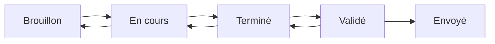

# Documentation Utilisateur - Module AuditDigital

## Table des matières

1. [Introduction](#introduction)
2. [Installation](#installation)
3. [Configuration initiale](#configuration-initiale)
4. [Guide d'utilisation](#guide-dutilisation)
5. [Gestion des audits](#gestion-des-audits)
6. [Administration](#administration)
7. [FAQ et dépannage](#faq-et-dépannage)
8. [Annexes](#annexes)

---

## Introduction

### Présentation du module

Le module **AuditDigital** est un outil complet intégré à Dolibarr permettant de réaliser des audits de maturité numérique pour les TPE/PME et collectivités territoriales. Il propose une approche structurée pour évaluer le niveau de digitalisation d'une organisation et générer des recommandations personnalisées.

### Fonctionnalités principales

- ✅ **Wizard d'audit interactif** en 6 étapes
- ✅ **Système de scoring automatique** par domaine
- ✅ **Génération de PDF professionnels**
- ✅ **Bibliothèque de solutions intégrée**
- ✅ **Recommandations personnalisées**
- ✅ **Calculs de ROI automatiques**
- ✅ **Interface responsive et moderne**

### Public cible

- **Consultants en transformation digitale**
- **Commerciaux Up Digit Agency**
- **Responsables IT**
- **Dirigeants d'entreprises**
- **Élus et techniciens de collectivités**

---

## Installation

### Prérequis techniques

| Composant | Version minimale | Recommandée |
|-----------|------------------|-------------|
| Dolibarr | 14.0 | 17.0+ |
| PHP | 7.4 | 8.1+ |
| MySQL/MariaDB | 5.7 | 8.0+ |
| Espace disque | 50 MB | 100 MB |
| Mémoire PHP | 128 MB | 256 MB |

### Modules Dolibarr requis

- ✅ **Tiers** (Sociétés/Contacts)
- ✅ **Projets** (optionnel mais recommandé)
- ✅ **API REST** (pour les intégrations)

### Étapes d'installation

#### 1. Téléchargement et copie

```bash
# Télécharger le module depuis GitHub
git clone https://github.com/12457845124884/audit.git

# Copier dans Dolibarr
cp -r audit/htdocs/custom/auditdigital /path/to/dolibarr/htdocs/custom/
```

#### 2. Activation du module

1. Connectez-vous à Dolibarr en tant qu'administrateur
2. Allez dans **Configuration → Modules/Applications**
3. Recherchez "AuditDigital" dans la liste
4. Cliquez sur **"Activer"**


#### 3. Installation automatique

1. Accédez à `/custom/auditdigital/install.php`
2. Cliquez sur **"Install AuditDigital Module"**
3. Vérifiez que tous les tests sont au vert
4. Confirmez l'installation

#### 4. Vérification

1. Accédez à `/custom/auditdigital/test.php`
2. Lancez les tests de vérification
3. Assurez-vous que tous les tests passent

---

## Configuration initiale

### Permissions utilisateurs

#### Rôles disponibles

| Rôle | Permissions |
|------|-------------|
| **Consultant** | Créer, modifier, consulter ses audits |
| **Manager** | Toutes les permissions + validation |
| **Administrateur** | Configuration + gestion complète |

#### Attribution des permissions

1. Allez dans **Configuration → Utilisateurs & Groupes**
2. Sélectionnez un utilisateur ou groupe
3. Dans l'onglet **"Permissions"**, section **"AuditDigital"** :

```
☑ Lire les audits
☑ Créer/modifier les audits  
☑ Supprimer les audits
☑ Valider les audits
☑ Exporter les audits
```

### Configuration du module

#### Accès à la configuration

**Configuration → Modules → AuditDigital → Configuration**

#### Paramètres essentiels

##### 1. Numérotation des audits

```
Masque par défaut : AUD{yyyy}{mm}{dd}-{####}
Exemple : AUD20241205-0001
```

**Personnalisation :**
- `{yyyy}` : Année sur 4 chiffres
- `{mm}` : Mois sur 2 chiffres  
- `{dd}` : Jour sur 2 chiffres
- `{####}` : Numéro séquentiel

##### 2. Modèles PDF

| Modèle | Usage | Description |
|--------|-------|-------------|
| `audit_tpe` | TPE/PME | Focus ROI et solutions pragmatiques |
| `audit_collectivite` | Collectivités | Conformité réglementaire |

##### 3. Configuration email

```php
Expéditeur : contact@updigit.fr
Nom : Up Digit Agency
Objet : Votre rapport d'audit digital - {REF}
```

### Chargement des solutions

#### Solutions prédéfinies

1. Allez dans **Configuration → AuditDigital → Bibliothèque de solutions**
2. Cliquez sur **"Charger les solutions depuis JSON"**
3. Vérifiez le nombre de solutions chargées

#### Solutions disponibles

- **Maturité numérique** : 15 solutions
- **Cybersécurité** : 12 solutions  
- **Cloud** : 10 solutions
- **Automatisation** : 8 solutions
- **Spécifiques collectivités** : 6 solutions

---

## Guide d'utilisation

### Créer un nouvel audit

#### Étape 1 : Accès au wizard

**Méthode 1 :** Menu principal
```
AuditDigital → Nouvel audit
```

**Méthode 2 :** Depuis une fiche tiers
```
Fiche société → Onglet "Audits" → Nouvel audit
```

#### Étape 2 : Wizard d'audit

##### 🏢 Étape 1 - Informations générales

**Champs obligatoires :**
- **Type de structure** : TPE/PME ou Collectivité
- **Tiers** : Sélection de la société cliente
- **Secteur d'activité** : Liste prédéfinie
- **Nombre d'employés** : Tranches prédéfinies
- **Budget IT annuel** : Estimation

**Champs optionnels :**
- **Projet associé** : Lien vers un projet Dolibarr
- **Objectifs principaux** : Sélection multiple


##### 💻 Étape 2 - Maturité numérique

**Domaines évalués :**

| Question | Options | Score |
|----------|---------|-------|
| Présence web | Aucun site (1) / Site basique (3) / Site moderne (5) | 1-5 |
| Réseaux sociaux | Aucune (1) / Basique (3) / Stratégie active (5) | 1-5 |
| Outils collaboratifs | Email seul (1) / Quelques outils (3) / Suite complète (5) | 1-5 |
| Digitalisation processus | Manuels (1) / Partiels (3) / Majoritaires (5) | 1-5 |
| Formation équipes | Aucune (1) / Ponctuelle (3) / Structurée (5) | 1-5 |

**Calcul du score :**
```
Score = (Somme des réponses / Score maximum) × 100
Exemple : (12/25) × 100 = 48%
```

##### 🔒 Étape 3 - Cybersécurité

**Évaluation sécuritaire :**

- **Politique mots de passe** : Complexité et renouvellement
- **Stratégie sauvegarde** : Fréquence et tests de restauration
- **Protection antivirus/firewall** : Niveau de protection
- **Formation cybersécurité** : Sensibilisation des équipes
- **Conformité RGPD** : Niveau de mise en conformité

**Spécificités collectivités :**
- Désignation DPO obligatoire
- Registre des traitements
- Procédures de notification

##### ☁️ Étape 4 - Cloud et infrastructure

**Infrastructure actuelle :**

- **Hébergement** : Sur site / Mutualisé / Cloud
- **Services cloud** : Niveau d'adoption
- **Besoins stockage** : Capacités et synchronisation
- **Télétravail** : Capacités techniques
- **Performance réseau** : Débit et fiabilité

**Critères collectivités :**
- **Souveraineté données** : Hébergement français/européen
- **Certification** : SecNumCloud, HDS
- **Réversibilité** : Capacité de récupération

##### ⚙️ Étape 5 - Automatisation

**Processus manuels identifiés :**
- ☑ Facturation
- ☑ Reporting  
- ☑ Saisie de données
- ☑ Communication client
- ☑ Gestion stocks

**Intégrations souhaitées :**
- CRM ↔ ERP
- Email ↔ CRM  
- Site web ↔ CRM
- Comptabilité ↔ Autres outils

**Gains attendus :**
- Temps économisé par semaine
- Budget disponible
- ROI espéré

##### 📊 Étape 6 - Synthèse et recommandations

**Affichage des résultats :**

```
┌─────────────────────────────────────┐
│           SCORES OBTENUS            │
├─────────────────────────────────────┤
│ Score Global        │ 67% │ ████████│
│ Maturité Numérique  │ 72% │ █████████│
│ Cybersécurité       │ 45% │ █████    │
│ Cloud               │ 68% │ ████████ │
│ Automatisation      │ 83% │ ██████████│
└─────────────────────────────────────┘
```

**Graphique radar :**
- Visualisation des 4 domaines
- Identification des points forts/faibles
- Comparaison avec les moyennes sectorielles

**Recommandations automatiques :**
- Top 5 des priorités
- Solutions adaptées au profil
- Calculs ROI personnalisés
- Planning de mise en œuvre

### Finalisation de l'audit

#### Validation

1. Vérifiez la cohérence des réponses
2. Consultez les recommandations
3. Cliquez sur **"Finaliser l'audit"**
4. L'audit passe au statut "Validé"

#### Génération PDF

**Automatique :** PDF généré lors de la validation

**Manuelle :** 
1. Fiche audit → Onglet "Documents"
2. Sélectionnez le modèle (TPE ou Collectivité)
3. Cliquez sur "Générer"

#### Envoi par email

1. Fiche audit → Bouton "Envoyer"
2. Vérifiez le destinataire
3. Personnalisez le message
4. PDF joint automatiquement
5. Envoi et traçabilité

---

## Gestion des audits

### Liste des audits

#### Accès
```
Menu : AuditDigital → Liste des audits
```

#### Fonctionnalités de la liste

**Colonnes affichées :**
- Référence et libellé
- Société cliente
- Type de structure
- Date d'audit
- Statut
- Scores (global et par domaine)

**Filtres disponibles :**
- Par statut (Brouillon/Validé/Envoyé)
- Par type de structure
- Par période
- Par société
- Par score (seuils configurables)

**Actions en masse :**
- Génération PDF multiple
- Envoi email groupé
- Export Excel
- Suppression multiple

#### Recherche avancée

```sql
Recherche textuelle : Référence, libellé, société
Filtres numériques : Scores min/max
Filtres dates : Période de création/audit
```

### Fiche audit détaillée

#### Onglets disponibles

##### 📋 Fiche principale

**Informations générales :**
- Référence et libellé
- Société et contact
- Dates importantes
- Statut et validation

**Scores détaillés :**
- Score global avec jauge colorée
- Scores par domaine
- Évolution (si audits précédents)
- Comparaison sectorielle

**Actions disponibles :**
- Modifier (si brouillon)
- Valider
- Dupliquer
- Supprimer
- Générer PDF
- Envoyer par email

##### 📝 Notes

**Note privée :** Visible équipe interne uniquement
**Note publique :** Visible client

**Usages recommandés :**
- Contexte de l'audit
- Observations terrain
- Points d'attention
- Suivi commercial

##### 📎 Documents

**Documents générés :**
- PDF d'audit (versions successives)
- Exports Excel
- Graphiques radar

**Documents joints :**
- Pièces justificatives
- Photos terrain
- Schémas réseau
- Contrats existants

##### 📅 Événements

**Historique automatique :**
- Création audit
- Modifications
- Validation
- Envois email
- Consultations PDF

**Événements manuels :**
- Rendez-vous client
- Appels téléphoniques
- Réunions de suivi
- Actions commerciales

### Workflow des statuts



#### Transitions possibles

| Statut actuel | Actions possibles | Permissions requises |
|---------------|-------------------|---------------------|
| **Brouillon** | Modifier, Supprimer | Créer/Modifier |
| **En cours** | Modifier, Finaliser | Créer/Modifier |
| **Terminé** | Valider, Modifier | Créer/Modifier |
| **Validé** | Envoyer, PDF | Valider |
| **Envoyé** | Consulter uniquement | Lire |

---

## Administration

### Configuration avancée

#### Accès administration
```
Configuration → Modules → AuditDigital → Configuration
```

#### Paramètres du questionnaire

**Personnalisation des questions :**

```php
// Fichier : class/questionnaire.class.php
// Ajouter une nouvelle question

'nouvelle_question' => array(
    'type' => 'radio',
    'label' => 'Ma nouvelle question',
    'required' => true,
    'score_mapping' => array(0 => 1, 1 => 3, 2 => 5),
    'options' => array(
        0 => 'Option 1',
        1 => 'Option 2', 
        2 => 'Option 3'
    )
)
```

**Types de questions supportés :**
- `radio` : Choix unique
- `checkbox` : Choix multiple
- `select` : Liste déroulante
- `text` : Texte libre
- `number` : Valeur numérique

#### Gestion des solutions

##### Accès
```
Configuration → AuditDigital → Bibliothèque de solutions
```

##### Ajouter une nouvelle solution

**Via interface :**
1. Cliquez sur "Nouvelle solution"
2. Remplissez le formulaire
3. Définissez les critères de ciblage
4. Sauvegardez

**Via JSON :**
```json
{
  "ref": "SOL-CUSTOM-001",
  "label": "Ma solution personnalisée",
  "category": "maturite_numerique",
  "sub_category": "presence_digitale",
  "target_audience": ["tpe", "pme"],
  "price_range": "10k",
  "implementation_time": 20,
  "priority": 8,
  "roi_percentage": 25,
  "roi_months": 12,
  "features": [
    "Fonctionnalité 1",
    "Fonctionnalité 2"
  ],
  "benefits": [
    "Bénéfice 1", 
    "Bénéfice 2"
  ],
  "requirements": [
    "Prérequis 1",
    "Prérequis 2"
  ],
  "description": "Description détaillée"
}
```

##### Critères de recommandation

**Algorithme de sélection :**
1. **Score seuil** : Solutions proposées si score < 60%
2. **Public cible** : Correspondance TPE/PME/Collectivité
3. **Budget** : Adéquation avec budget déclaré
4. **Priorité** : Classement par importance
5. **ROI** : Retour sur investissement

**Personnalisation des seuils :**
```php
// Configuration des seuils de recommandation
$conf->global->AUDITDIGITAL_SCORE_THRESHOLD_LOW = 40;
$conf->global->AUDITDIGITAL_SCORE_THRESHOLD_MEDIUM = 70;
$conf->global->AUDITDIGITAL_MAX_RECOMMENDATIONS = 5;
```

### Modèles PDF

#### Modèles disponibles

| Modèle | Fichier | Usage |
|--------|---------|-------|
| TPE/PME | `pdf_audit_tpe.modules.php` | Entreprises privées |
| Collectivité | `pdf_audit_collectivite.modules.php` | Secteur public |

#### Personnalisation PDF

**Structure du rapport :**
1. **Page de garde** : Logo, titre, références
2. **Synthèse exécutive** : Résumé 1 page
3. **Scores détaillés** : Graphiques et analyses
4. **Recommandations** : Top 5 priorités
5. **Solutions** : Fiches détaillées
6. **Planning** : Roadmap de mise en œuvre
7. **Proposition commerciale** : Devis intégré

**Éléments personnalisables :**
- Logo entreprise
- Couleurs et polices
- Contenu des sections
- Calculs de ROI
- Mentions légales

#### Créer un nouveau modèle

1. **Copier un modèle existant**
```bash
cp pdf_audit_tpe.modules.php pdf_audit_custom.modules.php
```

2. **Modifier la classe**
```php
class pdf_audit_custom extends ModelePDFAudit
{
    public function __construct($db)
    {
        parent::__construct($db);
        $this->name = "audit_custom";
        $this->description = "Modèle personnalisé";
    }
}
```

3. **Personnaliser le contenu**
4. **Activer dans la configuration**

### Sauvegardes et maintenance

#### Sauvegarde des données

**Tables à sauvegarder :**
```sql
-- Audits
llx_auditdigital_audit

-- Solutions personnalisées  
llx_auditdigital_solutions

-- Configuration
llx_const (WHERE name LIKE 'AUDITDIGITAL_%')
```

**Script de sauvegarde :**
```bash
#!/bin/bash
DATE=$(date +%Y%m%d_%H%M%S)
mysqldump -u user -p database \
  llx_auditdigital_audit \
  llx_auditdigital_solutions \
  > backup_auditdigital_$DATE.sql
```

#### Maintenance préventive

**Tâches mensuelles :**
- Vérification intégrité base de données
- Nettoyage fichiers temporaires
- Mise à jour solutions
- Contrôle performances

**Tâches trimestrielles :**
- Sauvegarde complète
- Analyse utilisation
- Optimisation requêtes
- Formation utilisateurs

### Monitoring et statistiques

#### Tableau de bord

**Métriques clés :**
- Nombre d'audits par mois
- Scores moyens par secteur
- Taux de conversion (audit → vente)
- Solutions les plus recommandées

**Accès :**
```
AuditDigital → Tableau de bord
```

#### Rapports disponibles

1. **Rapport d'activité mensuel**
2. **Analyse sectorielle**
3. **Performance commerciale**
4. **Utilisation des solutions**

---

## FAQ et dépannage

### Questions fréquentes

#### Installation et configuration

**Q : Le module ne s'active pas**
```
R : Vérifiez les prérequis :
- Dolibarr 14.0+
- PHP 7.4+
- Permissions d'écriture
- Modules Tiers et Projets activés
```

**Q : Les solutions ne se chargent pas**
```
R : Vérifiez :
- Fichier data/solutions.json présent
- Format JSON valide
- Permissions de lecture
- Logs d'erreur Dolibarr
```

**Q : Erreur génération PDF**
```
R : Contrôlez :
- Extension PHP-GD installée
- Mémoire PHP suffisante (256MB+)
- Répertoire documents accessible en écriture
- Modèle PDF sélectionné
```

#### Utilisation quotidienne

**Q : Comment modifier un audit validé ?**
```
R : Un audit validé ne peut plus être modifié.
Solutions :
- Dupliquer l'audit
- Créer un nouvel audit
- Demander à un administrateur de repasser en brouillon
```

**Q : Les scores semblent incorrects**
```
R : Vérifiez :
- Toutes les questions ont été répondues
- Mapping des scores dans questionnaire.class.php
- Calculs dans la méthode calculateStepScore()
```

**Q : Email non reçu**
```
R : Contrôlez :
- Configuration SMTP Dolibarr
- Adresse email destinataire
- Dossier spam/indésirables
- Logs d'envoi dans Dolibarr
```

### Codes d'erreur

| Code | Message | Solution |
|------|---------|----------|
| AUD001 | Questionnaire non trouvé | Vérifier fichier questionnaire.class.php |
| AUD002 | Solution introuvable | Recharger bibliothèque solutions |
| AUD003 | Erreur calcul score | Vérifier réponses complètes |
| AUD004 | PDF non généré | Contrôler modèle et permissions |
| AUD005 | Email non envoyé | Vérifier configuration SMTP |

### Logs et débogage

#### Activation du mode debug

```php
// Dans config.php
$conf->global->AUDITDIGITAL_DEBUG_MODE = 1;
$conf->global->AUDITDIGITAL_LOG_LEVEL = 'DEBUG';
```

#### Localisation des logs

```bash
# Logs Dolibarr généraux
/var/log/dolibarr/dolibarr.log

# Logs spécifiques module
/var/log/dolibarr/auditdigital.log

# Logs PHP
/var/log/php/error.log
```

#### Commandes de diagnostic

```bash
# Vérifier permissions
ls -la /path/to/dolibarr/htdocs/custom/auditdigital/

# Tester base de données
mysql -u user -p -e "SHOW TABLES LIKE 'llx_auditdigital_%'"

# Vérifier configuration PHP
php -m | grep -E "(gd|json|mysql)"
```

### Support technique

#### Niveaux de support

**Niveau 1 - Auto-diagnostic :**
- Consultation documentation
- Vérification FAQ
- Tests automatiques (`test.php`)

**Niveau 2 - Support communautaire :**
- Forum Dolibarr
- GitHub Issues
- Documentation technique

**Niveau 3 - Support professionnel :**
- Contact Up Digit Agency
- Support téléphonique
- Intervention sur site

#### Informations à fournir

**Pour toute demande de support :**
```
- Version Dolibarr
- Version PHP
- Version module AuditDigital
- Description du problème
- Étapes de reproduction
- Messages d'erreur
- Captures d'écran
```

---

## Annexes

### Annexe A : Grille de scoring détaillée

#### Maturité numérique (25 points max)

| Critère | Niveau 1 (1pt) | Niveau 2 (3pts) | Niveau 3 (5pts) |
|---------|----------------|------------------|------------------|
| **Site web** | Aucun | Vitrine basique | Moderne + mobile |
| **Réseaux sociaux** | Aucun | Présence passive | Stratégie active |
| **Outils collaboratifs** | Email seul | Quelques outils | Suite complète |
| **Digitalisation** | Processus manuels | Partiellement | Majoritairement |
| **Formation** | Aucune | Ponctuelle | Structurée |

#### Cybersécurité (25 points max)

| Critère | Niveau 1 (1pt) | Niveau 2 (3pts) | Niveau 3 (5pts) |
|---------|----------------|------------------|------------------|
| **Mots de passe** | Aucune politique | Politique basique | Stricte + 2FA |
| **Sauvegardes** | Aucune/manuelle | Occasionnelles | Auto + testées |
| **Protection** | Basique/inexistante | Antivirus postes | Solution complète |
| **Formation** | Aucune | Ponctuelle | Régulière + tests |
| **RGPD** | Non conforme | Partiellement | Totalement + DPO |

#### Cloud (25 points max)

| Critère | Niveau 1 (1pt) | Niveau 2 (3pts) | Niveau 3 (5pts) |
|---------|----------------|------------------|------------------|
| **Hébergement** | Serveurs physiques | Mutualisé | Cloud privé/hybride |
| **Services cloud** | Aucun | Quelques services | Infrastructure complète |
| **Stockage** | Local uniquement | Cloud basique | Solution avancée |
| **Télétravail** | Impossible/limité | Avec contraintes | Fluide et sécurisé |
| **Réseau** | Lent/instable | Correct | THD + redondance |

#### Automatisation (25 points max)

| Critère | Niveau 1 (1pt) | Niveau 2 (3pts) | Niveau 3 (5pts) |
|---------|----------------|------------------|------------------|
| **Processus manuels** | Nombreux | Quelques-uns | Rares |
| **Outils automation** | Aucun | Basiques | Plateforme avancée |
| **Intégrations** | Aucune | Quelques-unes | Écosystème intégré |
| **Gains temps** | < 5h/semaine | 5-15h/semaine | > 15h/semaine |
| **Budget dédié** | Aucun | Limité | Conséquent |

### Annexe B : Catalogue des solutions

#### Solutions Maturité Numérique

**SOL-WEB-001 : Site web vitrine moderne**
- **Public :** TPE/PME/Collectivités
- **Prix :** < 5k€
- **Délai :** 15 jours
- **ROI :** 25% en 12 mois

**SOL-WEB-002 : Plateforme e-commerce**
- **Public :** PME
- **Prix :** 10-15k€
- **Délai :** 30 jours
- **ROI :** 35% en 18 mois

**SOL-SM-003 : Stratégie réseaux sociaux**
- **Public :** TPE/PME
- **Prix :** < 5k€
- **Délai :** 20 jours
- **ROI :** 20% en 6 mois

#### Solutions Cloud

**SOL-CLOUD-002 : Google Workspace**
- **Public :** TPE/PME
- **Prix :** 5-10k€
- **Délai :** 20 jours
- **ROI :** 30% en 18 mois

**SOL-CLOUD-004 : Microsoft 365**
- **Public :** PME/Collectivités
- **Prix :** 10-15k€
- **Délai :** 25 jours
- **ROI :** 28% en 20 mois

**SOL-CLOUD-005 : Sauvegarde cloud**
- **Public :** Tous
- **Prix :** < 5k€
- **Délai :** 10 jours
- **ROI :** Protection données

#### Solutions Cybersécurité

**SOL-CYBER-003 : Firewall UTM**
- **Public :** PME/Collectivités
- **Prix :** 10-15k€
- **Délai :** 10 jours
- **ROI :** Protection

**SOL-CYBER-006 : Protection postes**
- **Public :** Tous
- **Prix :** < 5k€
- **Délai :** 5 jours
- **ROI :** Sécurité

**SOL-CYBER-007 : Formation cybersécurité**
- **Public :** Tous
- **Prix :** < 5k€
- **Délai :** 15 jours
- **ROI :** 50% en 12 mois

#### Solutions Automatisation

**SOL-AUTO-004 : Zapier workflows**
- **Public :** TPE/PME
- **Prix :** < 5k€
- **Délai :** 10 jours
- **ROI :** 40% en 6 mois

**SOL-AUTO-008 : Solution RPA**
- **Public :** PME/Collectivités
- **Prix :** > 20k€
- **Délai :** 45 jours
- **ROI :** 60% en 18 mois

**SOL-AUTO-009 : Gestion workflows**
- **Public :** PME/Collectivités
- **Prix :** 5-10k€
- **Délai :** 20 jours
- **ROI :** 25% en 12 mois

#### Solutions Collectivités

**SOL-COLL-005 : Portail citoyen**
- **Public :** Collectivités
- **Prix :** 15-20k€
- **Délai :** 30 jours
- **ROI :** 20% en 24 mois

**SOL-COLL-010 : Gestion délibérations**
- **Public :** Collectivités
- **Prix :** 10-15k€
- **Délai :** 25 jours
- **ROI :** 15% en 18 mois

**SOL-COLL-011 : SIG cartographie**
- **Public :** Collectivités
- **Prix :** 15-20k€
- **Délai :** 40 jours
- **ROI :** 10% en 36 mois

### Annexe C : API REST

#### Endpoints disponibles

**Authentification :**
```http
POST /api/index.php/login
Content-Type: application/json

{
  "login": "username",
  "password": "password"
}
```

**Liste des audits :**
```http
GET /api/index.php/auditdigital/audits
Authorization: Bearer {token}
```

**Détail audit :**
```http
GET /api/index.php/auditdigital/audits/{id}
Authorization: Bearer {token}
```

**Créer audit :**
```http
POST /api/index.php/auditdigital/audits
Authorization: Bearer {token}
Content-Type: application/json

{
  "label": "Nouvel audit",
  "fk_soc": 123,
  "structure_type": "tpe_pme"
}
```

**Générer PDF :**
```http
GET /api/index.php/auditdigital/audits/{id}/pdf
Authorization: Bearer {token}
```

#### Codes de réponse

| Code | Signification |
|------|---------------|
| 200 | Succès |
| 201 | Créé |
| 400 | Requête invalide |
| 401 | Non authentifié |
| 403 | Non autorisé |
| 404 | Non trouvé |
| 500 | Erreur serveur |

### Annexe D : Personnalisation avancée

#### Hooks disponibles

**Hook création audit :**
```php
// Dans un module tiers
public function doActions($parameters, &$object, &$action, $hookmanager)
{
    if ($parameters['currentcontext'] == 'auditcreation') {
        // Code personnalisé
    }
}
```

**Hook calcul score :**
```php
public function doActions($parameters, &$object, &$action, $hookmanager)
{
    if ($parameters['currentcontext'] == 'auditscore') {
        // Modifier le calcul de score
        $object->score_custom = $this->calculateCustomScore($object);
    }
}
```

#### Triggers disponibles

**AUDIT_CREATE :** Audit créé
**AUDIT_MODIFY :** Audit modifié
**AUDIT_VALIDATE :** Audit validé
**AUDIT_DELETE :** Audit supprimé

#### Extrafields

**Ajouter des champs personnalisés :**
```sql
-- Champ texte
INSERT INTO llx_extrafields 
(name, label, type, elementtype, entity) 
VALUES 
('custom_field', 'Mon champ', 'varchar', 'auditdigital_audit', 1);
```

---

**© 2024 Up Digit Agency - Tous droits réservés**

*Cette documentation est mise à jour régulièrement. Version 1.0.0 - Décembre 2024*